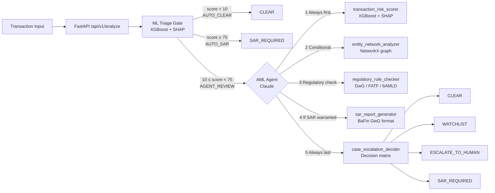

# AML-Shield

AI-powered Anti-Money Laundering compliance agent for BaFin-regulated financial institutions.

Unlike rule-based systems, AML-Shield uses a **3-tier ML triage gate + conditional ReAct agent** (Claude + XGBoost) that reasons step-by-step, cites exact regulatory articles (GwG §43, FATF Rec.16/19/20, EU 6AMLD), and produces a full audit trail with every decision. Every output is explainable via SHAP feature attributions — meeting the interpretability expectations of compliance officers and regulators.

---

## Architecture



### 3-Tier Triage Gate (`api/triage.py`)

Before the AI agent is invoked, every transaction is scored by XGBoost and routed into one of three lanes:

| Tier | Condition | Action |
|------|-----------|--------|
| `AUTO_CLEAR` | ML score < 10 | Pass through immediately — no agent |
| `AGENT_REVIEW` | 10 ≤ score < 75 | Claude agent performs deep investigation |
| `AUTO_SAR` | ML score ≥ 75 | Freeze and escalate — no agent needed |

Thresholds are tunable via `TRIAGE_LOW_THRESHOLD` and `TRIAGE_HIGH_THRESHOLD` environment variables. The conservative low threshold (10, not 25) minimises false negatives — the cost asymmetry of AML means an uncaught criminal is far more expensive than an unnecessary AI review.

---

## Quick Start

```bash
# 1. Clone and configure
git clone <repo-url>
cd aml-shield
pip install -r requirements.txt
cp .env.example .env
# Edit .env — at minimum set ANTHROPIC_API_KEY

# 2. Train the ML model (generates synthetic data if CSVs are absent)
python models/train.py

# 3. Run the API server
uvicorn api.main:app --reload

# 4. Analyze a transaction
curl -X POST http://localhost:8000/api/v1/analyze \
  -H "Content-Type: application/json" \
  -d '{
    "transaction_id": "TX-DEMO-001",
    "amount": 9750.00,
    "transaction_type": "wire_transfer",
    "sender_account": "DE89370400440532013000",
    "receiver_account": "IR-BANK-TEHRAN-44821",
    "sender_country": "DE",
    "receiver_country": "IR",
    "is_cross_border": true,
    "timestamp": "2024-03-15T02:34:00Z"
  }'
```

Or with Docker:

```bash
docker compose up
```

---

## Environment Variables

Copy `.env.example` and fill in the required values:

| Variable | Required | Default | Description |
|----------|----------|---------|-------------|
| `ANTHROPIC_API_KEY` | Yes | — | Anthropic API key |
| `ANTHROPIC_MODEL` | No | `claude-haiku-4-5-20251001` | Claude model ID |
| `DATABASE_URL` | No | `sqlite:///./aml_shield.db` | SQLAlchemy connection string |
| `REDIS_URL` | No | `redis://redis:6379` | Redis URL (for caching) |
| `MODEL_PATH` | No | `models/xgboost_aml.pkl` | Path to trained XGBoost model |
| `TRIAGE_LOW_THRESHOLD` | No | `10` | AUTO_CLEAR below this score |
| `TRIAGE_HIGH_THRESHOLD` | No | `75` | AUTO_SAR at or above this score |
| `LOG_LEVEL` | No | `INFO` | Python logging level |

---

## Example: Iran Wire Transfer Case

**Input**

```json
{
  "transaction_id": "TX-IRAN-001",
  "amount": 9750.00,
  "transaction_type": "wire_transfer",
  "sender_country": "DE",
  "receiver_country": "IR",
  "is_cross_border": true,
  "timestamp": "2024-03-15T02:34:00Z"
}
```

**Output** (excerpt)

```json
{
  "transaction_id": "TX-IRAN-001",
  "routing": "AGENT_REVIEW",
  "ml_score": 72.1,
  "ml_risk_level": "HIGH",
  "final_decision": "SAR_REQUIRED",
  "tool_calls_count": 5,
  "reasoning_chain": [
    {
      "type": "reasoning",
      "content": "THINK: Amount €9,750 is in the €8,500–€9,999 structuring band. Receiver is Iran (IR) — FATF blacklisted. Transaction at 02:34 AM. Rule B: I must use depth=3 for network analysis."
    },
    {
      "type": "tool_call",
      "tool_name": "transaction_risk_scorer",
      "input": { "amount": 9750, "receiver_country": "IR", "timestamp": "2024-03-15T02:34:00Z" }
    },
    {
      "type": "tool_result",
      "tool_name": "transaction_risk_scorer",
      "result": {
        "risk_score": 97.4,
        "shap_attributions": [
          { "feature": "is_high_risk_country", "shap": 0.821, "direction": "increases_risk" },
          { "feature": "is_near_ctr_threshold", "shap": 0.614, "direction": "increases_risk" },
          { "feature": "is_night", "shap": 0.392, "direction": "increases_risk" }
        ]
      }
    }
  ],
  "sar_report": {
    "report_id": "SAR-20240315-TX-IRAN0",
    "status": "DRAFT — pending compliance officer review",
    "tipping_off_warning": "LEGAL WARNING: Alerting the customer about this SAR filing constitutes a criminal offense under GwG §47 Abs. 5."
  }
}
```

---

## API Endpoints

| Method | Path | Description |
|--------|------|-------------|
| `POST` | `/api/v1/analyze` | Analyze a transaction (ML triage + optional agent) |
| `GET` | `/api/v1/cases` | List all analyzed cases |
| `GET` | `/api/v1/cases/{id}` | Retrieve a specific case by ID |
| `GET` | `/api/v1/health` | Health check |

---

## Technical Highlights

- **3-tier ML triage gate** — XGBoost prescreens every transaction before AI is invoked. Only medium-risk cases (score 10–75) enter the agent queue, keeping latency and token costs proportional to actual risk.
- **Conditional ReAct agent** — not a fixed pipeline. The agent branches based on risk score (Rule A: skip network analysis for low-risk domestic; Rule B: depth=3 for score >80; Rule E: sanctions fast-track).
- **XGBoost + SHAP explainability** — every risk score is backed by ranked feature attributions, meeting EU AI Act interpretability requirements.
- **Regulatory grounding** — all rules cite exact articles: GwG §43 Abs. 1, FATF Rec.16/19/20, EU 6AMLD Art. 18, Wire Transfer Regulation 2015/847.
- **SAR draft generation** — auto-generates BaFin/GwG-format SAR reports with tipping-off warnings (GwG §47 Abs. 5) and goAML submission guidance.
- **Full reasoning chain** — every tool call input, output, and agent reasoning step is logged and returned to the compliance officer for audit trail.
- **Configurable model** — swap Claude models via `ANTHROPIC_MODEL` without code changes (defaults to Haiku for cost-efficient development).

---

## Dataset: IBM AMLworld (NeurIPS 2023)

This project uses the IBM AMLworld dataset, not PaySim.

**Download:** https://www.kaggle.com/datasets/ealtman2019/ibm-transactions-for-anti-money-laundering-aml

Place CSV files in `data/`:

```
data/HI-Small_Trans.csv    data/LI-Small_Trans.csv
data/HI-Medium_Trans.csv   data/LI-Medium_Trans.csv
data/HI-Large_Trans.csv    data/LI-Large_Trans.csv
```

If no data is present, `python models/train.py` automatically generates 2,000 synthetic transactions (70% legitimate / 30% suspicious) for development.

---

## Running Tests

```bash
pytest tests/ -v
```

---

## Project Structure

```
aml-shield/
├── agent/
│   ├── core.py          # AMLAgent class, ReAct loop, AgentResult
│   ├── executors.py     # Tool executor functions (5 tools)
│   ├── prompts.py       # SYSTEM_PROMPT with regulatory citations
│   └── tools.py         # Anthropic Tool-Use API definitions
├── api/
│   ├── main.py          # FastAPI app, CORS, lifespan
│   ├── schemas.py       # Pydantic v2 request/response models
│   ├── database.py      # SQLite/PostgreSQL case persistence
│   ├── triage.py        # 3-tier ML triage gate (AUTO_CLEAR / AGENT_REVIEW / AUTO_SAR)
│   └── routes/
│       ├── analyze.py   # POST /api/v1/analyze
│       ├── cases.py     # GET /api/v1/cases, GET /api/v1/cases/{id}
│       └── health.py    # GET /api/v1/health
├── models/
│   ├── features.py      # Feature engineering (14 features)
│   ├── train.py         # XGBoost training pipeline
│   ├── predict.py       # SHAP inference
│   └── train.ipynb      # Exploratory training notebook
├── tests/
│   ├── test_agent.py    # Agent ReAct loop + executor unit tests
│   └── test_api.py      # FastAPI endpoint tests
├── data/                # IBM AMLworld CSVs (not committed)
├── demo.py              # CLI smoke-test script
├── Dockerfile
├── docker-compose.yml
└── requirements.txt
```
